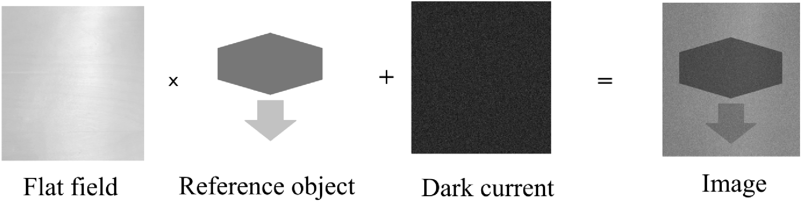

# FFCGAN: A deep-learning approach for flat-field correction at EuXFEL
FFCGAN is a supervised deep-learning approach for real-time flat-field correction at large-scale facilities. It is based on a generative adversarial neural network, and we include [Fourier Ring Correlation loss](https://doi.org/10.1364/OE.423222) to improve the performance.
For more detailed information about FFCGAN training and performance, please refer to the [paper](https://doi.org/10.1364/OE.451914).

<p align="center">

<!--  -->
Flat-field correction is the process to retrieve noise-free object from the measured detector images.
</p>


## Getting Started
### Prerequisites

- Linux (not tested for MacOS or Windows)
- Python3
- NVIDIA GPU (not tested for CPU)

### Installation

Clone this repo:

```
git clone https://github.com/yuhez/FlatFieldCorrection.git
cd FlatFieldCorrection
```
To install the required python packages:

```
conda env create -f ffc.yml
```

### FFCGAN training
For the training, our provided several data loaders in [dataset](https://github.com/yuhez/FlatFieldCorrection/blob/master/dataset/) support loading data with HDF5 format. Please check the details there.

For the training with other data formats, you may want to create a customized data loader. 

Modify training parameters in [FFC_exp.yaml](https://github.com/yuhez/FlatFieldCorrection/blob/master/configs/FFC_exp.yaml) and [default.yaml](https://github.com/yuhez/FlatFieldCorrection/blob/master/configs/default.yaml).

To run the training:

`bash train.sh`

For more training options, please check out:

`python3 FFCGAN.py --help`

### Results

Online visualization at the server and port specified in [FFC_exp.yaml](https://github.com/yuhez/FlatFieldCorrection/blob/master/configs/FFC_exp.yaml). 
The training results will be saved in: `./Results`.
The training parameters and losses will be saved to a txt file here: `./logs/`.


## Citation
If you use this code for your research, please cite our paper.
```
@article{buakor2022shot,
  title={Shot-to-shot flat-field correction at X-ray free-electron lasers},
  author={Buakor, Khachiwan and Zhang, Yuhe and Birn{\v{s}}teinov{\'a}, {\v{S}}arlota and Bellucci, Valerio and Sato, Tokushi and Kirkwood, Henry and Mancuso, Adrian P and Vagovic, Patrik and Villanueva-Perez, Pablo},
  journal={Optics Express},
  volume={30},
  number={7},
  pages={10633--10644},
  year={2022},
  publisher={Optica Publishing Group}
}

```
## Acknowledgments
The U-Net model we used is based on [TernausNet](https://github.com/ternaus/TernausNet).
